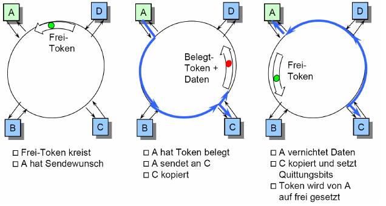

# Network Access Layer

## Subnetzwerktypen

- Leitungsvermittelt: 
      - Stellt jedem Nutzer einen `physikalischen` Pfad zur Verfügung (z.B. durch Multiplexing)
      - Stets verbindungsorientiert
      - Vermittlungsweg wird beim Verbindungsaufbau festgelegt
- Paketvermittelt:
      - Stellt einzelnen Paket einen `Beförderungsweg` zur Verfügung
      - Häufig verbindungslos
      - Pakete werden autonom vermittelt

## Medienzugriffsverfahren

- Single Access
      - Netzwerk zwischen wei Teilnehmern steht exklusiv über dedizierte "Leitungen" zur Verfügung
- Multiple Access
      - Gemeinsame Netzwerknutzung durch viele Teilnehmer über geteilte Leitungen
      - Synchronisationsproblem zur Kanalreservierung
      - Carrier Sense: Wenn das Medium eine bestimmte Zeit lang (IFS) frei ist, kann gesendet werden.
      - Tritt eine Kollision auf, bekommt der Sender eine Meldung. Nach erhalt dieser Meldung schickt dieser an alle ein `jam` Signal. Somit wird sichergestellt, dass jeder die Kollision mitbekommt.
      - Dann wird eine zufällige Zeit gewartet und die Nachricht wird noch einmal gesendet.
      - Problem: Kollision kann erst nach t = 2*ŧ (ŧ = Kabellaufzeit) garantiert werden
          - Deshalb: minimale Paketlänge = 2 * ŧ * v (v = NW-Speed)

## Ethernet Protokollaufbau
 
- MAC-Adressen
      - 6 Byte lang
      - weltweit eindeutig
      - `fest` auf die Netzkarte eingebrannt

### Maximale Framerate

- v = NW Datenrate = 10 Mbit/s
- S = min Framesize = 84 * 8 bit
- Maximale Framerate = v/S = 10 000 000 / (84*8) /s = 14 880 Frames pro Sekunde

### Maximaler Durchsatz (relevanter)

- Max. Framerate = v/S = 812.74 frames/s
- Max. Datendurchsatz = Max. Framerate * Payload = 812.74 * (1500 * 8) = 9 752 880 bit/s

## Logical Link Control

- Zusätzliche Schicht um eine Steuerung der Datenübertragung zu gewährleisten
- Das Protkoll unterscheidet zwischen:
      - Unzuverlässigen Datagram-Dienst
      - Datagram-Dienst mit Paketbestätigung (ACKs)
      - Zuverlässigen verbindungsorientierten Dienst
- Header beinhaltet:
      - Ziel-Access-point
      - Quell-Access-point
      - Kontrollfeld -> Seq- und Ack-nummern

## Token Ring

- Stationen sind in einem Ring verbunden
- Zuteilung des Senderechts durch zirkulierenden Token